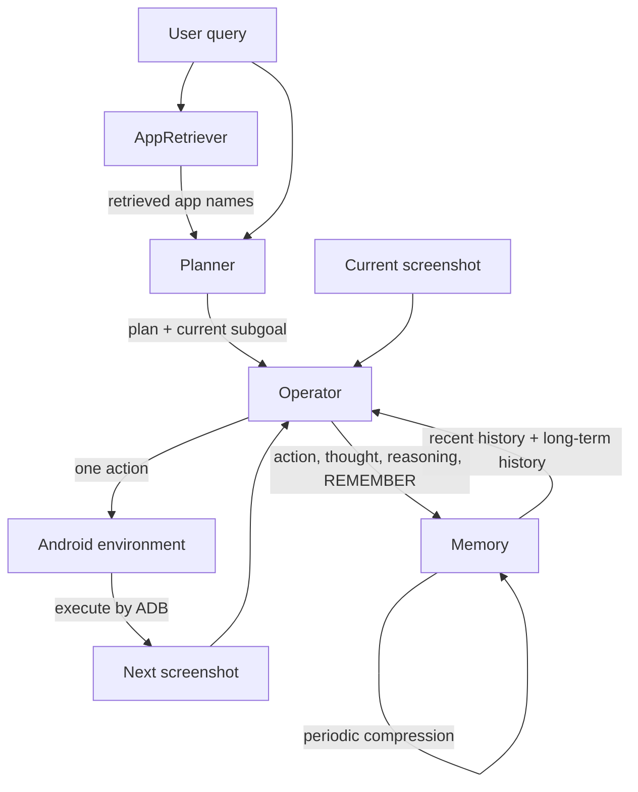

# ColorMobileAgent

ColorMobileAgent is a compact mobile GUI agent adapted for the open-source MobileUse framework. It is designed to work with [ColorGUI-32B](https://huggingface.co/MadeAgents/ColorGUI-32B), a unified model that can serve the app retrieval, planning, operation, and memory roles.

The implementation keeps the runtime small while preserving the core execution loop:

- **AppRetriever**: selects task-related installed apps from the ColorOS app mapping.
- **Planner**: rewrites the user query and produces a Chinese task plan.
- **Operator**: observes the current phone screenshot and emits one action in a fixed 999x999 coordinate system.
- **Memory**: compresses older execution history and keeps recent steps available for the operator.

## Files

```text
mobile_use/agents/color_mobile_agent.py
mobile_use/agents/color_mobile/
  app_mapping.py
  app_retriever.py
  planner.py
  operator.py
  memory.py
  parser.py

mobile_use/default_prompts/
  color_mobile_app_retriever.yaml
  color_mobile_planner.yaml
  color_mobile_operator.yaml
  color_mobile_memory.yaml

configs/color_mobile_agent.yaml
```

## Flow



## App Retrieval

`ColorMobileAppRetriever` uses the structured app mapping in:

```text
mobile_use/agents/color_mobile/app_mapping.py
```

Each app has one canonical `name`, one Android `package`, and optional `aliases`:

```python
APP_MAPPING = [
    {
        "name": "哔哩哔哩",
        "package": "tv.danmaku.bili",
        "aliases": ["B站", "b站"],
    },
]
```

The retriever only sends canonical app names to the planner. Aliases are still used by the execution layer, so both `open[哔哩哔哩]` and `open[B站]` resolve to the same package.

To avoid sending the full list to the planner when retrieval is enabled, the retriever splits the app list into chunks and calls the configured text model in parallel.

Default configuration:

```yaml
app_retriever:
  enabled: true
  prompt_config: color_mobile_app_retriever.yaml
  chunk_size: 40
  max_apps: 30
  max_workers: 5
```

Behavior:

- The app list is split into chunks of 40 names.
- Up to 5 chunks are processed in parallel.
- Each retriever call can only select apps from its own chunk.
- Results are merged, deduplicated by package name, and capped by `max_apps`.
- If no app is selected, the planner receives `未提供`.
- If `app_retriever.enabled` is set to `false`, the planner receives the full deduplicated app list from `app_mapping.py`.

The planner receives only the retrieved app names:

```text
用户任务：帮我找附近咖啡店并导航过去
已安装应用列表：美团、高德地图、百度地图
```

## Planner

The planner is a text-only agent. It does not receive screenshots.

Input:

```text
用户任务：{query}
已安装应用列表：{related_install_apps_context}
```

Expected output:

```text
意图：[用户意图]
改写后的query：[改写后的查询]
需打开的应用名：[应用名或“无”]
query难度：【难/易】
是否需要操作屏幕：【是/否】
任务分解：
task1：xxx
task2：xxx
直接回答：[如果不需要操作屏幕，填写回答]
tips：xxx
first_open_app: [需要打开的第一个应用名；不需要则写“无”]
```


## App Opening

The operator can output a Chinese app name:

```text
thought: ...###reasoning: 打开应用###action: open[美团]
```

Before execution, ColorMobileAgent resolves the Chinese app name through `app_mapping.py`:

```text
open[美团] -> open[com.sankuai.meituan]
```

If the value is already a package name or cannot be found in the mapping, it is passed through unchanged.

## Operator

The operator receives:

- user instruction
- planner output
- recent execution history
- long-term compressed history
- current screenshot as an image message

The screenshot is not forced to 999x999 before being sent to the model. By default, `operator.max_pixels` is `1024 * 1024`, so very large screenshots are resized proportionally to keep the image area under that limit. The model is still expected to output coordinates in the 999x999 relative coordinate system. These coordinates are converted back to the device's original screenshot resolution before execution.

Supported action format:

```text
thought: ...###reasoning: ...###action: CLICK[x,y]
thought: ...###reasoning: ...###action: TYPE[x,y,text]
thought: ...###reasoning: ...###action: SWIPE[x1,y1,x2,y2]
thought: ...###reasoning: ...###action: open[APP_NAME]
thought: ...###reasoning: ...###action: call_user[T#text]
thought: ...###reasoning: ...###action: COMPLETE
```

`REMEMBER` can be appended after `action`:

```text
thought: ...###reasoning: ...###action: CLICK[300,700]###REMEMBER: 当前屏幕已看到目标店铺
```

## Memory

Memory keeps two types of history:

- **Recent history**: uncompressed recent steps for the operator.
- **Long-term history**: compressed summary of older steps.

Default configuration:

```yaml
memory_compress_every_steps: 2
memory_recent_steps_after_compress: 2
```

With this setting:

- Step 4 compresses Step 1-2 and keeps Step 3-4 as recent history.
- Step 5 keeps Step 3-5 as recent history.
- Step 6 compresses Step 3-4 and keeps Step 5-6 as recent history.

Already compressed raw steps are not sent again as raw history. The memory model receives the existing long-term summary plus the new uncompressed steps that are ready to be summarized. The long-term history shown to the operator is cumulative, so after Step 6 it summarizes Step 1-4 while Step 5-6 remain in recent history.

## Usage

Start an OpenAI-compatible service for `ColorGUI-32B` first. One minimal `vLLM` example is:

```bash
python -m vllm.entrypoints.openai.api_server \
  --host 0.0.0.0 \
  --port 8000 \
  --trust-remote-code \
  --served-model-name ColorGUI-32B \
  --model MadeAgents/ColorGUI-32B \
  --dtype bfloat16 \
  --tensor-parallel-size 4 \
  --max-model-len 8196 \
  --gpu-memory-utilization 0.9 \
  --limit-mm-per-prompt image=5
```

Then edit `configs/color_mobile_agent.yaml`:

```yaml
vlm:
  model_name: ColorGUI-32B
  api_key: <your-api-key>
  base_url: http://127.0.0.1:8000/v1
  max_tokens: 1024
  temperature: 0

env:
  serial_no: <adb-device-serial>
  go_home: true

operator:
  max_pixels: 1048576
```

Then run:

```python
import mobile_use

agent = mobile_use.Agent.from_params({
    "type": "ColorMobileAgent",
    "config_path": "configs/color_mobile_agent.yaml",
})

agent.set_max_steps(20)
agent.run("帮我用美团找附近咖啡店")
```

## Notes

- Keep the full app mapping in code, not in the planner prompt.
- Planner should see only retrieved app candidates.
- Operator action coordinates are always based on 999x999.
- The same model endpoint can be used for AppRetriever, Planner, Operator, and Memory.
- Adjust `tensor-parallel-size` in the serving command based on the number of available GPUs.
